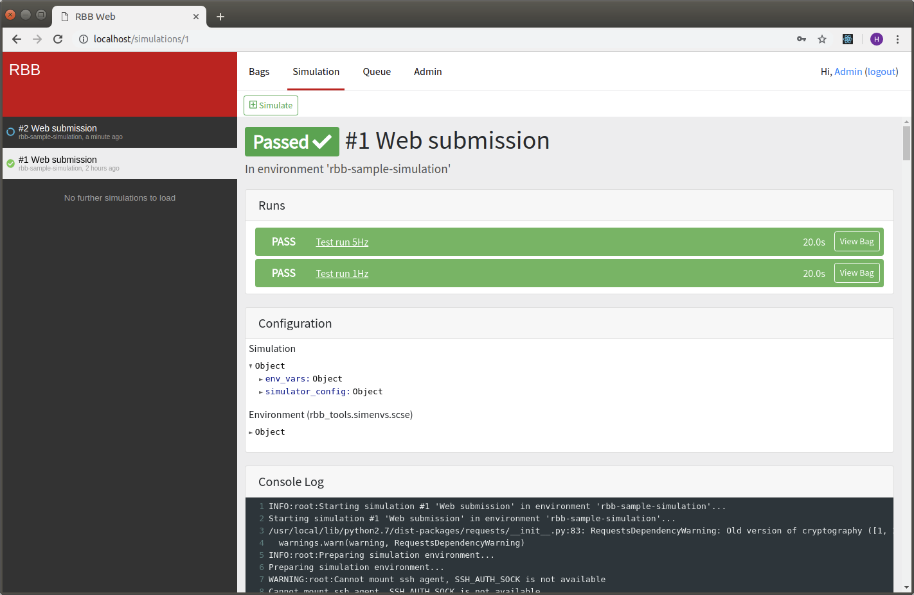
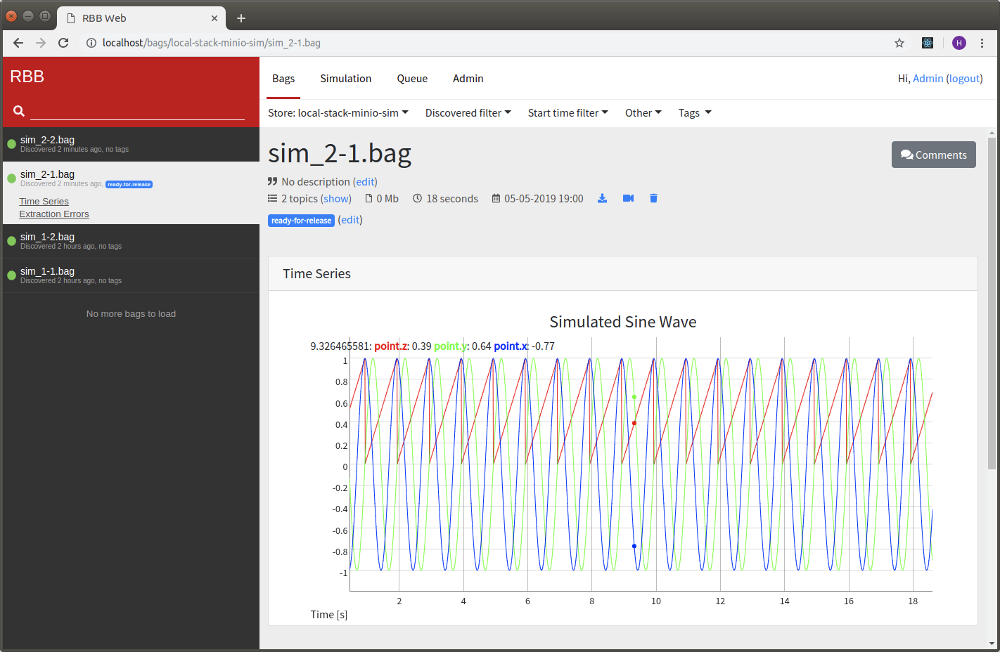

# RBB Core
This repository contains the core of the Rosbag Bazaar (RBB), a tool to index/visualize/manage rosbags on remote storage systems. Additionally it provides a web interface and framework for automated simulations. A work queue similar to most continuous integration systems allows processing of long running compute intensive jobs for both rosbag visualization and simulation. The aim is to keep the underlying storage system completely abstracted to allow development of plugins for most cloud based storage systems. (Currently only AWS S3 compatible storage is fully supported)

If you are using RViz to look at the content of your bag files, and want to have this visualization recorded for every rosbag automatically, and the recordings available on any computer with internet access. This software might be something for you.

If you currently simulate your robot with for example Gazebo, and want to automatically run it every night or for pull-requests. This software might be something for you.

This software has been developed on **Ubuntu 16.04** with **ROS Kinetic** (Newer versions of ROS (NOT ROS 2) will
most likely work without problems). The web interface is only tested with **Google Chrome**.

## Quickstart

The best way to find out if this software is in anyway useful for your project, is to run it on your own computer. This can be done in a few simple steps. (A fast internet connection is required, since several gigabytes need to be downloaded)
This will deploy RBB with the public images from Docker Hub. If you want to build your own images you can do so with the `build-containers.sh` script and change the `docker-compose.yaml` file accordingly.

1. Install docker, if you haven't got it already. [Follow the instructions here](https://docs.docker.com/install/linux/docker-ce/ubuntu/#install-using-the-repository)

2. Install docker-compose, [Follow the instructions here](https://docs.docker.com/compose/install/#install-compose)

3. Clone this repository:
   `git clone https://github.com/AMZ-Driverless/rbb_core.git`

4. Run docker-compose in the local-stack subdirectory:
   `cd rbb_core/deploy/local-stack && docker-compose up`

5. In your browser go to `http://localhost` and login
   with user *admin* and password *admin*

6. The demo setup comes pre-configured with several external sources.

7. Data is stored in a local [minio](https://min.io/) server. The control panel can be accessed on `http://localhost:9000` (login with MINIOKEY / MINIOSUPERSECRET)

## Development

### Repository Layout

* **rbb_server/rbb_server** (Python 3.5): Rosbag bazaar server implementation
* **rbb_server/rbb_swagger_server** (Python 3.5): Auto generated swagger server
* **rbb_client** (Python 2.7 & 3.5): Auto generated swagger API client
* **rbb_storage/rbb_storage** (Python 2.7 & 3.5): Storage abstraction layer
* **rbb_storage/rbb_storage_s3** (Python 2.7 & 3.5): Integration with AWS S3
* **rbb_tools** (Python 2.7): Actual generation of content from the rosbags

The web interface is written in typescript and can be found in [this repository](https://github.com/AMZ-Driverless/rbb_web).

### Dependencies

To record RViz the following dependencies need to be installed:

* Xephyr (sudo apt-get install xserver-xephyr)
* Xvfb (sudo apt-get install xvfb)
* xdotool (sudo apt-get install xdotool)
* ffmpeg (sudo apt-get install ffmpeg)
* VirtualGL (download .deb from https://virtualgl.org)

### Documentation

See the docs directory. For bag visualization configuration see [Rosbag visualizations](docs/configuring-bag-visualization.md).

### Running the tests

Run the script `run-tests` from the root of the repository.
